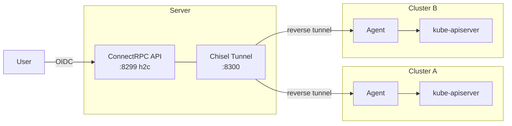

# OtterScale Agent

A hub-and-spoke gateway for managing Kubernetes resources across clusters through a single [ConnectRPC](https://connectrpc.com/) API.

The **server** (hub) authenticates requests via OIDC, then routes them through [Chisel](https://github.com/jpillora/chisel) reverse tunnels to **agents** (spokes) running inside target clusters. Agents proxy requests to the local Kubernetes API server using impersonation, so cluster RBAC is enforced at the edge.



## Features

- **Multi-cluster** -- manage any number of Kubernetes clusters from one endpoint.
- **Dynamic registration** -- agents register on connect via CSR-based mTLS enrolment; no static per-cluster config on the server.
- **OIDC authentication** -- bearer tokens verified against Keycloak; identity forwarded via Kubernetes impersonation.
- **Full resource lifecycle** -- Discovery, Schema, List, Get, Create, Apply (SSA), Delete, Watch (streaming).
- **Observability** -- OpenTelemetry tracing, Prometheus metrics at `/metrics`, gRPC health checks.

## Quick Start

### Prerequisites

- Go 1.25+
- A Keycloak realm (or any OIDC issuer) for token verification
- `KUBECONFIG` or in-cluster service account for the agent

### Build

```bash
go build -o otterscale ./cmd/otterscale
```

### Run the server

```bash
./otterscale server \
  --address=:8299 \
  --tunnel-address=127.0.0.1:8300 \
  --tunnel-key-seed=my-secret-seed \
  --allowed-origins=https://dashboard.example.com \
  --keycloak-realm-url=https://keycloak.example.com/realms/otterscale \
  --keycloak-client-id=otterscale
```

### Run an agent

```bash
./otterscale agent \
  --cluster=production \
  --server-url=http://server-host:8299 \
  --tunnel-server-url=http://server-host:8300
```

The agent registers with the server, receives a one-time tunnel token, and establishes a reverse tunnel. The server can then proxy Kubernetes API requests to the agent's cluster.

## Configuration

Values are resolved in this order (highest wins):

1. **CLI flags** (e.g. `--address=:8299`)
2. **Environment variables** (prefix `OTTERSCALE_`, dots become underscores: `OTTERSCALE_SERVER_ADDRESS`)
3. **Config file** (`config.yaml` in `.` or `/etc/otterscale/`)
4. **Compiled defaults**

### Server flags

| Flag | Env | Default | Description |
|------|-----|---------|-------------|
| `--address` | `OTTERSCALE_SERVER_ADDRESS` | `:8299` | HTTP listen address |
| `--allowed-origins` | `OTTERSCALE_SERVER_ALLOWED_ORIGINS` | *(required)* | CORS allowed origins (must be set in server mode) |
| `--tunnel-address` | `OTTERSCALE_SERVER_TUNNEL_ADDRESS` | `127.0.0.1:8300` | Chisel tunnel listen address |
| `--tunnel-key-seed` | `OTTERSCALE_SERVER_TUNNEL_KEY_SEED` | `change-me` | Deterministic key seed for tunnel CA (HKDF + P-256) |
| `--keycloak-realm-url` | `OTTERSCALE_SERVER_KEYCLOAK_REALM_URL` | | Keycloak OIDC issuer URL |
| `--keycloak-client-id` | `OTTERSCALE_SERVER_KEYCLOAK_CLIENT_ID` | `otterscale` | Expected `aud` claim |

### Agent flags

| Flag | Env | Default | Description |
|------|-----|---------|-------------|
| `--cluster` | `OTTERSCALE_AGENT_CLUSTER` | `default` | Cluster name for registration |
| `--server-url` | `OTTERSCALE_AGENT_SERVER_URL` | `http://127.0.0.1:8299` | Fleet server URL |
| `--tunnel-server-url` | `OTTERSCALE_AGENT_TUNNEL_SERVER_URL` | `http://127.0.0.1:8300` | Chisel tunnel server URL |
| `--tunnel-timeout` | `OTTERSCALE_AGENT_TUNNEL_TIMEOUT` | `30s` | Tunnel keep-alive interval |

## Architecture

```
cmd/otterscale/          Entry point, Wire DI
internal/
├── app/                 ConnectRPC service handlers (Fleet, Resource)
├── cmd/
│   ├── agent/           Agent runtime (reverse proxy + tunnel client)
│   └── server/          Server runtime (HTTP + tunnel listener)
├── config/              Viper-based configuration
├── core/                Domain interfaces and use-cases
├── middleware/           OIDC authentication middleware
├── providers/
│   ├── chisel/          TunnelProvider (loopback-per-cluster addressing)
│   ├── kubernetes/      DiscoveryClient + ResourceRepo via client-go
│   └── otterscale/      TunnelConsumer (fleet registration client)
└── transport/
    ├── http/            HTTP/H2C server with CORS + auth middleware
    └── tunnel/          Chisel tunnel client and server wrappers
api/
├── fleet/v1/            Fleet service protobuf + generated code
└── resource/v1/         Resource service protobuf + generated code
test/
└── integration/         Integration tests
```

### How it works

1. The **server** starts an HTTP server (ConnectRPC) and a Chisel tunnel listener.
2. An **agent** calls `FleetService.Register` with a CSR. The server signs it with the internal CA and returns the signed certificate, CA certificate, and tunnel endpoint.
3. The agent opens a mTLS Chisel reverse tunnel using the signed certificate, exposing its local Kubernetes API proxy to the server via a unique loopback address (e.g. `127.42.1.1:16598`). Each cluster gets a distinct address in the `127.0.0.0/8` range (up to ~16M clusters).
4. When a user calls `ResourceService.List` (or any resource RPC), the server resolves the cluster to its loopback address and proxies the request through the tunnel. The agent impersonates the authenticated user against the real kube-apiserver.

### Security model

- **User -> Server**: OIDC bearer token verified against Keycloak. Unauthenticated paths: health, reflection, fleet registration.
- **Server -> Agent**: mTLS tunnel — the server runs an internal CA (deterministic from `--tunnel-key-seed`) that signs agent CSRs. Tunnel credentials are derived from the signed certificate so both sides can compute them independently. Key derivation uses HKDF (RFC 5869) with P-256 ECDSA keys.
- **Agent -> kube-apiserver**: in-cluster service account with impersonation privileges. Requests carry the authenticated user's identity via Kubernetes impersonation headers. RBAC is enforced by the target cluster.
- **CORS**: in server mode, `--allowed-origins` must be explicitly configured — the server refuses to start without it to prevent accidental open-origin exposure in production.

## API

**Protocol**: ConnectRPC over HTTP/1.1 and h2c (unencrypted HTTP/2).

### FleetService

| RPC | Description |
|-----|-------------|
| `ListClusters` | List all registered clusters |
| `Register` | Register an agent and obtain tunnel credentials |

### ResourceService

| RPC | Description |
|-----|-------------|
| `Discovery` | List available API resources on a cluster |
| `Schema` | Fetch OpenAPI schema for a GVK |
| `List` | List resources with label/field selectors and pagination |
| `Get` | Get a single resource by name |
| `Create` | Create a resource from a YAML manifest |
| `Apply` | Server-side apply (SSA) a manifest |
| `Delete` | Delete a resource |
| `Watch` | Stream real-time watch events (server-streaming) |

Protobuf definitions: [`api/fleet/v1/fleet.proto`](api/fleet/v1/fleet.proto), [`api/resource/v1/resource.proto`](api/resource/v1/resource.proto).

## Development

```bash
go build ./...        # build
go test ./...         # test
go vet ./...          # vet
```

## License

Apache-2.0
