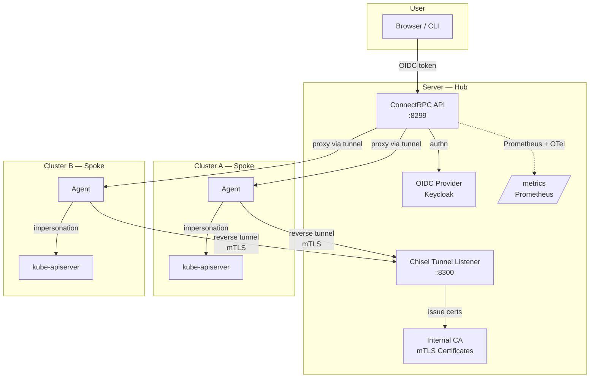
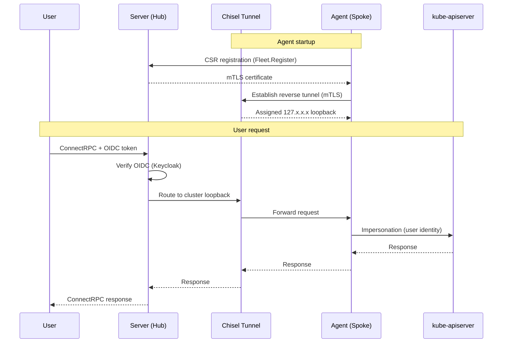

# OtterScale Agent


Multi-cluster Kubernetes API gateway that unifies access to distributed clusters through a single ConnectRPC endpoint, using Chisel reverse tunnels and OIDC authentication.

## Architecture

OtterScale Agent follows a **Hub-and-Spoke** topology with a **Hexagonal Architecture (Ports & Adapters)** layering:

| Layer | Directory | Responsibility |
|---|---|---|
| **Transport** | `internal/handler/` | ConnectRPC service handlers; maps protobuf requests to use cases |
| **Use Case** | `internal/core/` | Business logic orchestration (Fleet / Resource / Runtime), free of implementation details |
| **Ports** | `internal/core/` (interfaces) | Abstractions: `TunnelProvider`, `ResourceRepo`, `DiscoveryClient`, etc. |
| **Adapters** | `internal/providers/` | Chisel tunnel, Kubernetes client-go, OtterScale API client, Manifest renderer |
| **Config** | `internal/config/` | Unified config loading via Viper + Cobra |
| **DI** | `cmd/otterscale/wire.go` | Compile-time dependency injection via Google Wire |

### System Flow



### Request Sequence



## Prerequisites

| Dependency | Version |
|---|---|
| Go | >= 1.25.6 |
| protoc | + `protoc-gen-go`, `protoc-gen-connect-go` (proto generation only) |
| golangci-lint | latest (linting only) |
| Docker | any recent version (container build) |
| Kubernetes | >= 1.28 (agent deployment) |

## Getting Started (Local Dev)

```bash
# Clone
git clone https://github.com/otterscale/otterscale-agent.git
cd otterscale-agent

# Download dependencies
go mod download

# Build (downloads bootstrap manifests + compiles binary with FIPS 140-3)
make build

# Binary is output to ./bin/otterscale
./bin/otterscale --version
```

### Run Server

```bash
./bin/otterscale server \
  --address :8299 \
  --tunnel-address 127.0.0.1:8300 \
  --keycloak-realm-url https://keycloak.example.com/realms/otterscale \
  --allowed-origins "http://localhost:3000"
```

### Run Agent

```bash
./bin/otterscale agent \
  --cluster my-cluster \
  --server-url http://127.0.0.1:8299 \
  --tunnel-server-url https://127.0.0.1:8300
```

### Make Targets

| Target | Description |
|---|---|
| `make build` | Compile CLI to `./bin/` (auto-downloads bootstrap manifests) |
| `make test` | Run tests with coverage report |
| `make lint` | Run golangci-lint |
| `make vet` | Run `go vet` |
| `make proto` | Generate `*.pb.go` and ConnectRPC stubs from `.proto` files |
| `make openapi` | Generate `api/openapi.yaml` |
| `make update-bootstrap` | Force re-download FluxCD and otterscale-operator manifests |

## Deployment (Kubernetes)

### Build Docker Image

```bash
docker build -t otterscale-agent:latest .
```

Image properties:

- Base image: `gcr.io/distroless/static:nonroot` (minimal attack surface)
- FIPS 140-3 enabled (`GOFIPS140=latest`, `GODEBUG=fips140=on`)
- Non-root user `65532:65532`
- Exposed ports: `8299` (ConnectRPC API), `8300` (Tunnel)
- Default entrypoint: `server` mode

### Deploy Agent to a Cluster

Agents can be installed via the manifest endpoint. The HMAC token is generated through the Server UI or `Fleet.GetAgentManifest` RPC:

```bash
kubectl apply -f https://otterscale.example.com/fleet/manifest/<token>
```

The agent bootstrap process automatically installs:
- **FluxCD** v2.4.0
- **OtterScale Operator** v0.2.6

## Configuration

All configuration is managed through Viper. Resolution order (highest wins):

1. **CLI flags**
2. **Environment variables** (prefix `OTTERSCALE_`, dots become underscores)
3. **Config file** (`config.yaml` in `.` or `/etc/otterscale/`)
4. **Compiled defaults**

### Server Options

| Variable | Flag | Description | Default | Required |
|---|---|---|---|---|
| `OTTERSCALE_SERVER_ADDRESS` | `--address` | HTTP listen address | `:8299` | No |
| `OTTERSCALE_SERVER_ALLOWED_ORIGINS` | `--allowed-origins` | CORS allowed origins | `[]` | Yes |
| `OTTERSCALE_SERVER_TUNNEL_ADDRESS` | `--tunnel-address` | Chisel tunnel listen address | `127.0.0.1:8300` | No |
| `OTTERSCALE_SERVER_TUNNEL_CA_DIR` | `--tunnel-ca-dir` | Directory for persistent CA cert & key | `/var/lib/otterscale/ca` | No |
| `OTTERSCALE_SERVER_KEYCLOAK_REALM_URL` | `--keycloak-realm-url` | Keycloak OIDC issuer URL | `""` | Yes |
| `OTTERSCALE_SERVER_KEYCLOAK_CLIENT_ID` | `--keycloak-client-id` | Expected OIDC `aud` claim | `otterscale-server` | No |
| `OTTERSCALE_SERVER_EXTERNAL_URL` | `--external-url` | Externally reachable server URL for agent connections | `""` | Yes\* |
| `OTTERSCALE_SERVER_EXTERNAL_TUNNEL_URL` | `--external-tunnel-url` | Externally reachable tunnel URL for agent tunnel connections | `""` | Yes\* |

> \* Required for agent manifest generation.

### Agent Options

| Variable | Flag | Description | Default | Required |
|---|---|---|---|---|
| `OTTERSCALE_AGENT_CLUSTER` | `--cluster` | Cluster name for registration | `default` | No |
| `OTTERSCALE_AGENT_SERVER_URL` | `--server-url` | Control-plane server URL | `http://127.0.0.1:8299` | Yes |
| `OTTERSCALE_AGENT_TUNNEL_SERVER_URL` | `--tunnel-server-url` | Tunnel server URL | `https://127.0.0.1:8300` | Yes |
| `OTTERSCALE_AGENT_BOOTSTRAP` | `--bootstrap` | Run Layer 0 bootstrap on startup (install FluxCD + Operator CRD) | `true` | No |

## API Surface

### ConnectRPC Services

| Service | Methods |
|---|---|
| `otterscale.fleet.v1.FleetService` | `ListClusters`, `Register`, `GetAgentManifest` |
| `otterscale.resource.v1.ResourceService` | `Discovery`, `Schema`, `List`, `Get`, `Describe`, `Create`, `Apply`, `Delete`, `Watch` |
| `otterscale.runtime.v1.RuntimeService` | `PodLog`, `ExecuteTTY`, `WriteTTY`, `ResizeTTY`, `PortForward`, `WritePortForward`, `Scale`, `Restart` |

### Operational Endpoints

| Path | Description |
|---|---|
| `/grpc.health.v1.Health/*` | gRPC health checks |
| `/grpc.reflection.v1.ServerReflection/*` | gRPC server reflection |
| `/metrics` | Prometheus metrics scraping |
| `GET /fleet/manifest/{token}` | Raw YAML agent manifest (HMAC-authenticated) |

## Project Structure

```
otterscale-agent/
├── api/                          # Protobuf definitions & generated code
│   ├── fleet/v1/                 #   Fleet service (cluster registration)
│   ├── resource/v1/              #   Resource service (CRUD + watch)
│   └── runtime/v1/               #   Runtime service (logs, exec, port-forward)
├── cmd/otterscale/               # Entrypoint, Cobra commands, Wire injection
├── internal/
│   ├── bootstrap/                # Layer 0 bootstrap (FluxCD + Operator install)
│   ├── cmd/                      # Cobra subcommand constructors
│   │   ├── agent/                #   Agent mode (spoke)
│   │   └── server/               #   Server mode (hub): HTTP mux, background tasks
│   ├── config/                   # Viper/Cobra config binding & option definitions
│   ├── core/                     # Domain logic & port interfaces
│   │   ├── fleet.go              #   FleetUseCase (cluster lifecycle)
│   │   ├── resource.go           #   ResourceUseCase (K8s resource CRUD)
│   │   ├── runtime.go            #   RuntimeUseCase (exec, logs, port-forward)
│   │   └── session.go            #   TTY / port-forward session store
│   ├── handler/                  # ConnectRPC service implementations
│   ├── pki/                      # Internal CA (cert generation, CSR signing)
│   ├── providers/                # Adapter implementations
│   │   ├── cache/                #   Discovery cache + OpenAPI schema resolver
│   │   ├── chisel/               #   Chisel tunnel server/client
│   │   ├── kubernetes/           #   client-go (dynamic, discovery, SPDY)
│   │   ├── manifest/             #   Agent manifest YAML renderer
│   │   └── otterscale/           #   Fleet registrar (agent -> server)
│   └── transport/                # Network transport abstractions
│       ├── http/                 #   HTTP server with OIDC & CORS
│       ├── pipe/                 #   In-process net.Listener (testing)
│       └── tunnel/               #   Chisel tunnel bridge & client
├── manifests/                    # Embedded bootstrap manifests (FluxCD, Operator)
├── third_party/                  # Vendored proto dependencies (gnostic)
├── Dockerfile                    # Multi-stage build (distroless, FIPS 140-3)
├── Makefile                      # Build, test, lint, proto generation
└── go.mod
```

## License

Apache License 2.0 -- see [LICENSE](LICENSE).
