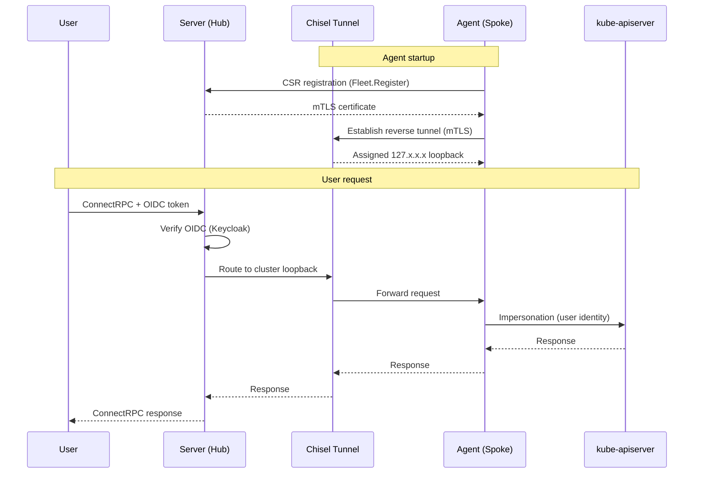

# OtterScale Agent


**Multi-cluster Kubernetes API gateway — unified ConnectRPC endpoint over Chisel reverse tunnels with OIDC + mTLS.**

## Architecture

### Request Sequence



## 🚀 Quick Start

```bash
# Clone
git clone https://github.com/otterscale/otterscale-agent.git && cd otterscale-agent

# Build (downloads bootstrap manifests, FIPS 140-3 enabled)
make build

# Run server locally
./bin/otterscale server \
  --address :8299 \
  --keycloak-realm-url https://id.example.com/realms/otterscale \
  --allowed-origins https://app.example.com \
  --external-url https://api.example.com \
  --external-tunnel-url https://tunnel.example.com

# Run agent (in-cluster)
./bin/otterscale agent \
  --server-url https://api.example.com \
  --tunnel-server-url https://tunnel.example.com \
  --cluster my-cluster

# Docker
docker build -t otterscale-agent .
docker run -p 8299:8299 -p 8300:8300 otterscale-agent
```

## ⚙️ Configuration

Env prefix: `OTTERSCALE_`, dots → underscores. Config file: `config.yaml` in `.` or `/etc/otterscale/`.

### Server

| ENV_VAR                                 | Default                  | Description                                 |
| --------------------------------------- | ------------------------ | ------------------------------------------- |
| `OTTERSCALE_SERVER_ADDRESS`             | `:8299`                  | HTTP listen address                         |
| `OTTERSCALE_SERVER_ALLOWED_ORIGINS`     | —                        | CORS origins **(required)**                 |
| `OTTERSCALE_SERVER_TUNNEL_ADDRESS`      | `127.0.0.1:8300`         | Chisel tunnel listen address                |
| `OTTERSCALE_SERVER_TUNNEL_CA_DIR`       | `/var/lib/otterscale/ca` | Persistent CA cert/key directory            |
| `OTTERSCALE_SERVER_KEYCLOAK_REALM_URL`  | —                        | OIDC issuer URL **(required)**              |
| `OTTERSCALE_SERVER_KEYCLOAK_CLIENT_ID`  | `otterscale-server`      | Expected OIDC `aud` claim                   |
| `OTTERSCALE_SERVER_EXTERNAL_URL`        | —                        | Public server URL for agents **(required)** |
| `OTTERSCALE_SERVER_EXTERNAL_TUNNEL_URL` | —                        | Public tunnel URL for agents **(required)** |

### Agent

| ENV_VAR                              | Default                  | Description                              |
| ------------------------------------ | ------------------------ | ---------------------------------------- |
| `OTTERSCALE_AGENT_CLUSTER`           | `default`                | Cluster name                             |
| `OTTERSCALE_AGENT_SERVER_URL`        | `http://127.0.0.1:8299`  | Control-plane URL **(required)**         |
| `OTTERSCALE_AGENT_TUNNEL_SERVER_URL` | `https://127.0.0.1:8300` | Tunnel URL **(required)**                |
| `OTTERSCALE_AGENT_BOOTSTRAP`         | `true`                   | Install FluxCD + Operator CRD on startup |

## Features

- **Fleet** — Agent registration with auto-provisioned mTLS certs (CSR flow)
- **Resources** — Generic K8s CRUD, watch, server-side apply across clusters
- **Runtime** — Exec/TTY, log streaming, port-forward, scale, rolling restart
- **Discovery** — API resource discovery + OpenAPI schema resolution with TTL cache
- **Security** — FIPS 140-3, OIDC (Keycloak), per-tunnel mTLS, user impersonation for RBAC

## API

ConnectRPC services (gRPC, gRPC-Web, Connect protocols):

| Service                       | Key RPCs                                                      |
| ----------------------------- | ------------------------------------------------------------- |
| `fleet.v1.FleetService`       | `ListClusters`, `Register`, `GetAgentManifest`                |
| `resource.v1.ResourceService` | `List`, `Get`, `Create`, `Apply`, `Delete`, `Watch`, `Schema` |
| `runtime.v1.RuntimeService`   | `PodLog`, `ExecuteTTY`, `PortForward`, `Scale`, `Restart`     |

Health: `grpc.health.v1.Health` · Reflection: `grpc.reflection.v1` · Metrics: `GET /metrics`

## License

[Apache 2.0](LICENSE)
